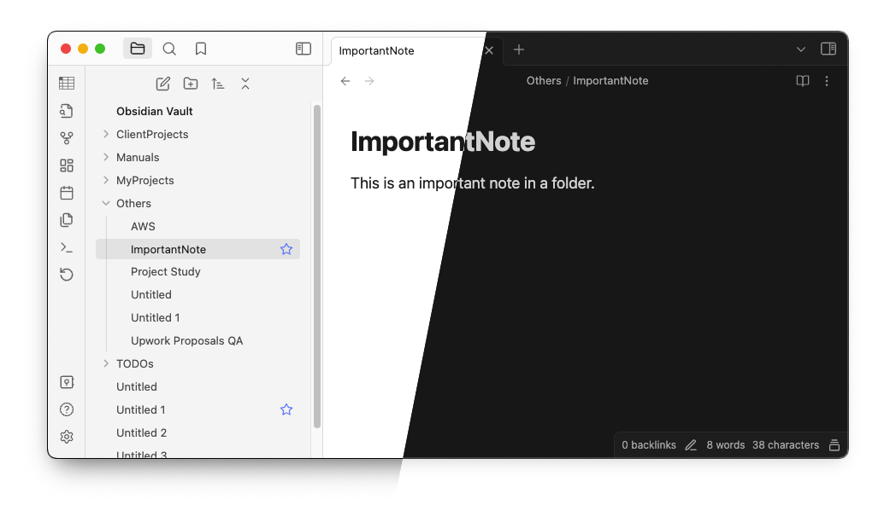

# Obsidian Favorite Note Plugin

	

The missing Obsidian plugin to mark your note as favorite.

## What sets this plugin appart from the core [Bookmarks](https://help.obsidian.md/Plugins/Bookmarks) plugin?

This plugin introduces the ability to mark individual notes as favorites directly within the note list, offering a more convenient and visual way to manage and access preferred notes. Unlike the core Bookmarks feature, which focuses on general document navigation and linking, this plugin is tailored for users who want a streamlined method to highlight and access specific notes of importance.

### How to Install

You can activate this plugin within Obsidian by doing the following:

#### Manually

- Download the latest release zip file
- Extract and put the three files (main.js, manifest.json, styles.css) to folder {{ YOUR VAULT}}/.obsidian/plugins/favorite-note
- Open Settings > Community plugins
- Make sure Restricted mode is off
- Activate the plugin

#### From Obsidian

- Open Settings > Community plugins
- Make sure Restricted mode is off
- Click Browse community plugins
- Search for "Favorite Note"
- Click Install
- Once installed, close the community plugins window and activate the "Favorite Note" plugin
- Now you will see a heart icon if you hover to a note from the list
